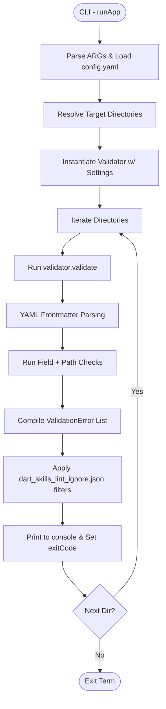

# Architecture Overview: Agent Skills Linter (`dart_skills_lint`)

This document provides a high-level architectural overview of the `dart_skills_lint` codebase. It outlines the project's components, execution flow, and design patterns used to validate Agent Skill specifications.

## 🧱 Key Components

The codebase is organized into standard Dart package layers, separating CLI handling, validation logic, and data models.

### 🚗 1. CLI Entry Point (`lib/src/entry_point.dart`)
The `entry_point.dart` file serves as the command-line interface. 
- **Argument Parsing:** Uses standard `package:args` to parse input flags (`--skills-directory`, `--generate-baseline`, rules toggles, etc.).
- **Workspace Discovery:** Resolves target folders by searching standard locations (e.g., `.agents/skills`, `.claude/skills`) or parsing user arguments.
- **Ignore System Integration:** Handlers for `dart_skills_lint_ignore.json` (baseline files) to filter out known failures without failing the build.
- **Log Management:** Consumes validation reports and standardizes format for terminal display (stouts vs stderr).

### ⚙️ 2. Configuration Parser (`lib/src/config_parser.dart`)
- Loads user-defined custom settings from `dart_skills_lint.yaml` if it exists.
- Maps directory-specific rules overrides and toggles severity defaults.

### 🛡️ 3. Validation Engine (`lib/src/validator.dart`)
The core motor of the package.
- Scans `SKILL.md` using regular expressions (`dotAll: true`) to extract Frontmatter.
- Delegates to sub-routines for checking:
  - **Directory structure:** Correct place and flat tree constraints.
  - **Field constraints:** Descriptions vs name match.
  - **Relational properties:** Verifies relative links resolve correctly on disc.
- Outputs `ValidationResult` objects wrapping aggregates of `ValidationError`.

### 📜 4. Predefined Rules templates (`lib/src/rules.dart`)
Contains global definitions for standard checks. Uses standard types (`CheckType`) allowing toggling and severity states.

### 📦 5. Core Data Models (`lib/src/models/`)
- **`ValidationError`:** Complex error object recording rule IDs, messages, severity contexts, and ignore statuses.
- **`CheckType`:** A schema binding check descriptions to severity settings.
- **`IgnoreEntry`:** Structure for serializing/deserializing file suppressions to/from JSON.

---

## ⏳ Execution Lifecycle

A typical run of the linter follows this sequential graph:

## 🧠 Design Principles

- **Separation of Concerns:** CLI runners are isolated from pure validation units. The `Validator` takes objects and doesn't know about `ArgResults`.
- **Stateless Configuration vs Overrides:** When running against a workspace with specific subdirectory traits, the `Validator` instances are re-instantiated with isolated context bindings so properties do not leak.
- **Context Preservation:** Standardizing lint exceptions (Ignore Systems) as structural objects rather than ad-hoc string matches prevent brittle regressions.
